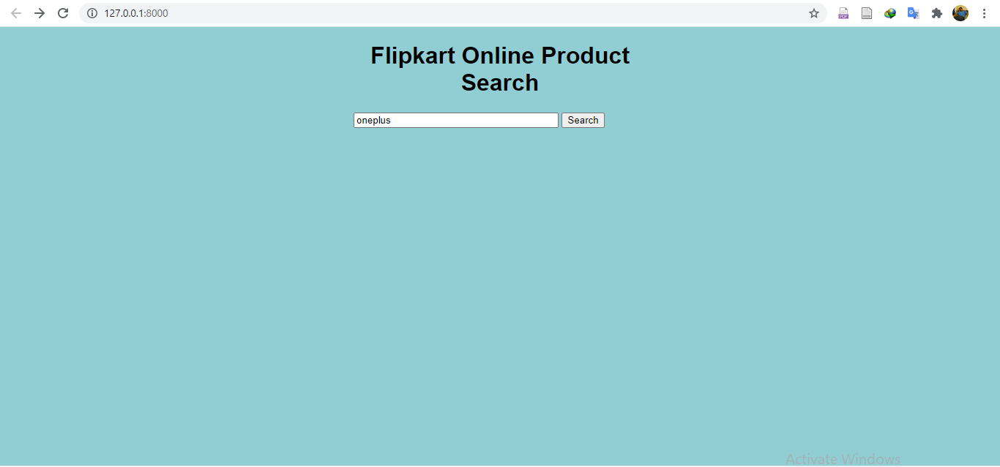
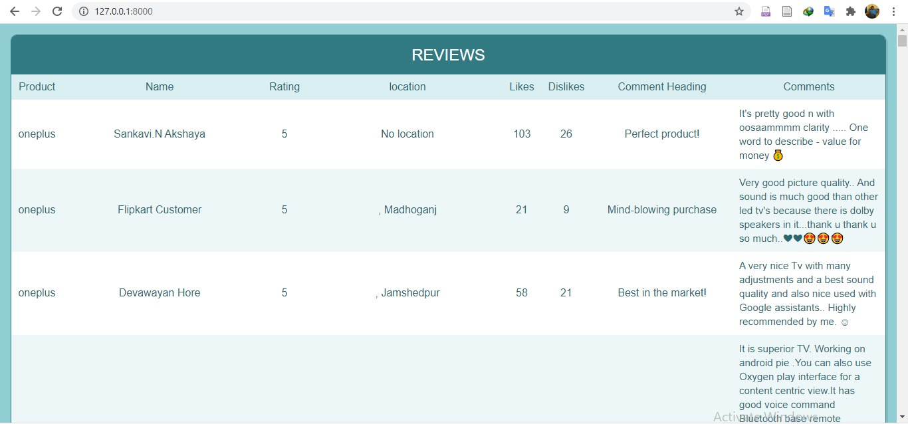

# Data Analysis of Online_Product_Webscraping

- Used Beautifulsoup library to convert website html data to text data.
- If Data not found in NoSQL (MongoDB) Database,scraped the data online and stored the processed structured data in MongoDB database 
- Analysis the product comments from database and predicted customer statisfaction using Natural language processing.
- Created the Customer product satisfaction dashboard in PowerBI 

- Data Architecture - Flipkart web page --> Search Flask API(Python) ---> MongoDB ---> NLP Flask API --> Tableau(Output)  

Technologies: Python, BeautifulSoup, MongoDB, Flask, Docker, Tableau,Natural Language Processing (NLP),Software Integration, Dashboard

### Input

Fig: Online product Dashboard web_scraping Input

### Output

Fig: Online product Dashboard web_scraping Output
